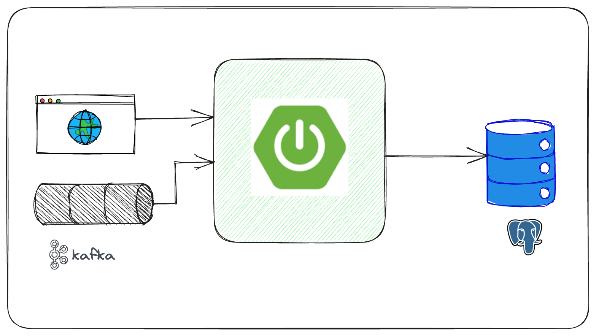

# Clone and Run Developer experience using Testcontainers

The sample Spring Boot application used for demonstrating how to use Testcontainers 
for having a simplified local development experience. 

[](https://www.youtube.com/watch?v=PWTKMVb4HIY)

## Prerequisites
* Java 17+. [Installation using SDKMAN](https://sdkman.io/)
* Docker. [Installation Instructions](https://docs.docker.com/get-docker/)

## Getting Started with the application
The application is a Spring Boot project that interacts with PostgreSQL and Kafka.



The best experience would be to simply clone and run the application without having to do any manual setup.

```shell
$ git clone https://github.com/sivaprasadreddy/clone-and-run-devexp-using-testcontainers.git
$ cd clone-and-run-devexp-using-testcontainers
# Run tests
$ ./mvnw test

# Start application from command-line
$ ./mvnw spring-boot:test-run

# Start application from IDE
# Run TestApplication.java from IDE
```

## References
* [Spring Boot Application Testing and Development with Testcontainers](https://www.atomicjar.com/2023/05/spring-boot-3-1-0-testcontainers-for-testing-and-local-development/)
* [Simple local development with Testcontainers Desktop](https://testcontainers.com/guides/simple-local-development-with-testcontainers-desktop/)
* [Local Development of Go Applications with Testcontainers](https://www.youtube.com/watch?v=CYBTPmvquCo)
